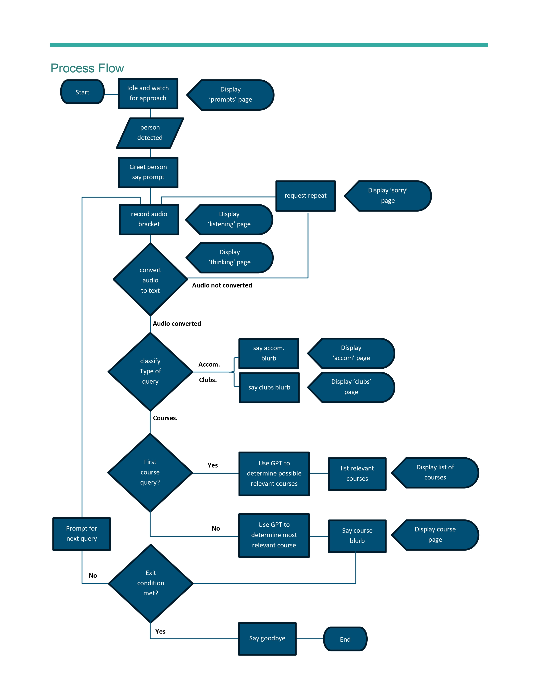

# Pepper Bot
Main repo for the Pepper-Bot project @ Deakin University.

The following documentation has been provided by H. Harland(_hharland@deakin.edu.au_). And compiled by Y. Vedi(_vedi.yash@gmail.com_) with some additional notes where relevant.

# Introduction
Pepper Bot is an interactive robot designed to assist students and staff at Deakin University. It leverages advanced AI and robotics technologies to provide information, guidance, and support in various campus-related activities. The bot is equipped with capabilities such as voice recognition, and natural language processing to interact seamlessly with users.

# Quick Start
To quickly get started with Pepper Bot, follow these steps:
1. Depending on the underlying platform, you can run either the `start.bat` file (for windows) or the `start.sh` file (for linux).
2. The file will launch 2 separate servers: local GPT server, and a jupyter server running python 2.7. The former is responsible for classifying the request made to the Pepper robot and generating an appropriate response to the query. The latter is responsible for handling the overall flow of the conversation, monitoring pepper's joint-tempratures etc. 
3. Open local host `http://localhost:8888/` on your machine which will take you to the jupyter server. 
4. Open the notebook `PepperDemo.ipynb` and run all cells. 

Pepper is now ready for interaction. The telltale signs include a display update on her front panel, random pepper "stretches" triggered roughly every 30 seconds. 

Note: It is important to ensure that the pepper's IP address is entered correctly. Failing to do so would result in the Jupyter Server being unable to connect with the robot. More information on this can be found in [About Pepper]() and [FAQ]() sections.   

# Development Environment
To get added as a collaborator on this project, please get approval from bahar.nakisa@deakin.edu.au. 

Note: This project is **open to contributions from Deakin University students only**.

## Getting Started with Docker

Note: _This section will be removed in future updates._ 

You will need to clone the repository to start contributing to the project. Furthermore, a docker image has been created and published to aid with the development (and eventually deployment) process involved in this project. The specific Dockerfiles used to build the image has been provided in the `/dockerfiles` folder. This folder will also have other dockerfiles used to host the code for other components of the overall project. Instructions to building the image yourself have been provided in `/dockerfiles/README.md` file.

In order to use the Dockerized development environment you need to have Docker installed on your system. More instructions for installation are given on the [official website](https://docs.docker.com/get-docker/).

Alternatively, you may also follow the instructions for installing the Python SDK on your own machine from the official websites [here](http://doc.aldebaran.com/2-5/dev/python/install_guide.html) and [here](https://www.aldebaran.com/en/support/pepper-naoqi-2-9/downloads-softwares). If you wish to follow this approach, you can skip the docker installation entirely and the instructions below. You may start contributing directly once the SDK is installed and working.

Once you have cloned the repository and have docker running on your system run the following command in the root of the project to get started. 
```powershell
docker run -p 8888:8888 -v "${PWD}:/app" vediyd/pepper-bot
```

Or on command prompt
```cmd
docker run -p 8888:8888 -v "%cd%:/app" vediyd/pepper-bot
```
This command has been tested on both powershell and Ubuntu18.04.

The output looks like this,
```terminal
    To access the notebook, open this file in a browser:
        file:///root/.local/share/jupyter/runtime/nbserver-1-open.html
    Or copy and paste one of these URLs:
        http://(a1e4dbc53a50 or 127.0.0.1):8888/?token=a1f543ff297067fcf18323d02793d810db6ff33e762a6a62
```

After launching the docker container, you can then use the returned url to access the jupyter interface through your system's browser. 

# Process Flow


# Useful Information for using this codebase

## String and State Definitions
### Pepper's Body Language types: 
- "loading" (was "thinking") [green eyes, tablet]
  - "listening" [blue eyes, tablet]
  - "confused" (was "error") [pink eyes, tablet]

### Pepper's state dict: 
- "topic" (string, describes flow position) ["fresh", "%error%" (if query[0]=="%"), "Cacc", "Club", "Camp", "Cour", "Cspe", "Cgen", "%low_volume_error%" (if query == "%low_volume_error%" in classifyQuery - should be unreachable? classifyQuery not called if query[0] == "%") 
  - "confusion" (int, limits total error before quit) [0-3]
  - "repeat" (bool, dictates whether the main sub-loop is repeated) [True, False]
  - "confident" (bool, dictates whether confirmation is needed) [True, False]

### Pepper's default image types:
- "prompt" (with speak bubbles)
  - "confused" (with pink 'sorry' pulse)
  - "loading" (with green 'thinking' bubble and moving dashes)
  - "listenining" (with blue 'listening' pulse)
  - "Cgen" (WelcomePage, with generic image and text)
  - "Cstu" (Lower banner page with some filler content)
  - "Cour" (Lower banner page with some filler content)
  - "Cacc" (Lower banner page with some filler content)
  - "Club" (Lower banner page with some filler content)
  - "Camp" (Lower banner page with some filler content)

## Module Dependencies

### 1: prompts.py

PURPOSE: to store and maintain a central reference for hardcoded quotes used by Pepper
CONTAINS: 
- combinedGreetingAndGenericPrompts(list)
  - basicGreetings(list)
  - basicTopicPrompts(list)
  - basicCoursePrompt(list)
  - courseInterlude(list)
  - confusionInterlude(list)
  - confusionRepeat(list)
  - combinedTopicPrompts(list)
  - tieredConfusionPrompts(list)
  - goodbyePrompts(list)
  - verificationPrompts(dict, topics)
  - topicBlurb(dict, topics)
  - noExamples(list)
  - yesExamples(list)
  PEPPER-BOT DEPENDENCIES: null
  OTHER PACKAGE DEPENDENCIES: null
  CONSTANT DEPENDENCIES: null
  USED IN: humanInteraction.py

### 2: fileTransfer.py

PURPOSE: manages SFTP and SSH to exchange files with Pepper
CONTAINS: 
- sendFromPepper(func)
  - sendToPepper(func)
  - setupSFTP(func)
  - closeSFTP(func)
  - sendFileToPepper(func, wraps sendToPepper)
  NAOQI DEPENDENCIES: username+password
  PEPPER-BOT DEPENDENCIES: null
  OTHER PACKAGE DEPENDENCIES: paramiko(SSHClient, AutoAddPolicy)
  CONSTANT DEPENDENCIES: PEPPER_HOST, PEPPER_PORT, PEPPER_RECORDINGS_PATH, SERVER_RECORDINGS_PATH
  USED IN: displayGeneration.py, interactiveControls.py, humanInteraction.py

### 3: displayGeneration.py

PURPOSE: manages creation of HTML files for Pepper's display
CONTAINS: 
- pepperLog(func)
  - duplicateTemplate(func)
  - seekCourseName(func)
  - seekLocationText(func)
  - seekHeadText(func)
  - seekBodyText(func)
  - seekCourseAndLocationText(func)
  - seekCourseNameList(func)
  - textSub(func)
  - subHeadText(func)
  - subBodyText(func)
  - subCourseText(func)
  - subLocationText(func)
  - subCourseAndLocationText(func)
  - subListText(func)
  - seekQR(func)
  - seekImg(func)
  - sendPage(func)
  - seekAndSend(func)
  - generateBasicQRPage(func)
  - generateTopBannerQRPage(func)
  - generateBottomBannerQRPage(func)
  - generateBottomBannerWithBodyQRPage(func)
  - generateOnlyTextAndImgPage(func)
  - generateBasicListViewPage(func)
  - generateDashLoader(func)
  - generateDefaultPage(func)
  - generateListeningPage(func)
  - generateErrorPage(func)
  - generateWelcomePage(func)
  - generateUpperCourseQRPage(func)
  - generateUpperCoursePage(func, don't use)
  - generateStudyPage(func)
  - generateAccommodationPage(func)
  - generateClubPage(func)
  - generateCampusPage(func)
  NAOQI DEPENDENCIES: null
  PEPPER-BOT DEPENDENCIES: 
  - fileTransfer[sendFileToPepper]
  - textByID.txt
  - QRCodes(folder of pngs)
  - imgFiles(folder of pngs), pageTemplates(folder of HTMLs)
  OTHER PACKAGE DEPENDENCIES: 
  - bs4[BeautifulSoup]
  - re[compile]
  - shutil[copyfile]
  - pandas[read_csv]
  CONSTANT DEPENDENCIES: FILE_NAME_TEMP, TEXT_BY_ID_PATH, PEPPER_QR_LANDING, PEPPER_IMG_LANDING, PEPPER_PAGE_LANDING, PEPPER_HTML_PATH
  LOCAL CONSTANTS: PATH_PREFIX, IMG_FILES_FOLDER, QR_CODES_FOLDER
  USED IN: interactiveControls.py, humanInteraction.py

### 4: interactiveControls.py

PURPOSE: wrappers for controls on Pepper's behaviours, body language etc. 
CONTAINS: 
- track_head(func)
  - stop_track_head(func)
  - set_leds(func)
  - EyesController(class)[__init__, colourEyes(method), startEyes(method), setEyes(method), stopEyes(method)]
  - return_to_default_pos(func)
  - defaultPosture(func)
  - resetEyesAndTablet(func, tablet not implemented)
  - showWhichPage(func)
  - show_on_tablet(func)
  - stop_show_on_tablet(func)
  - showPage(func)
  - hidePage(func)
  NAOQI DEPENDENCIES: ALProxy
  PEPPER-BOT DEPENDENCIES: 
  - fileTransfer[sendToPepper]
  - displayGeneration[generateDefaultPage, generateDashLoader, generateWelcomePage, generateStudyPage, generateUpperCoursePage, generateListeningPage, generateAccommosationPage, generateClubPage, generateCampusPage, generateErrorPage]
  OTHER PACKAGE DEPENDENCIES: 
  - threading[Thread]
  - time[sleep]
  CONSTANT DEPENDENCIES: PEPPER_HOST, PEPPER_PORT, PEPPER_PAGE_LANDING
  LOCAL CONSTANTS: null
  USED IN: humanInteraction.py

### 5: idle.py

PURPOSE: manages Pepper's idle behaviours that maintain her motors
CONTAINS: 
- idling(class)[__init__, idle_behavior_thread(method), start_idle_behaviour(method), stop(method)]
NAOQI DEPENDENCIES: ALProxy
PEPPER-BOT DEPENDENCIES: null
OTHER PACKAGE DEPENDENCIES: 
  - random[choice]
  - threading[Thread]git 
  - time[sleep, time]
  CONSTANT DEPENDENCIES: PEPPER_HOST, PEPPER_PORT
  LOCAL CONSTANTS: null
  USED IN: humanInteraction.py, PepperDemo.ipynb

### 6: humanInteraction.py

PURPOSE: manages Pepper's interactions with users, interactive behaviours use interactiveControls to control
CONTAINS:
- detect(func)
  - listen(func)
  - speak(func)
  - shush(func)
  - processQuery(func)
  - promptForNextQuery(func)
  - sayGoodbye(func)

NAOQI DEPENDENCIES: ALProxy
PEPPER-BOT DEPENDENCIES: 
- prompts[basicGreetings, basicTopicPrompts, yesExamples, verificationPrompts, confusionRepeat, tieredConfusionPrompts, topicBlurb]
  - fileTransfer[sendFromPepper]
  - interactiveControls[showWhichPage, set_leds, showPage]
  - displayGeneration[generateBasicListViewPage, generateBasicQRPage]
  OTHER PACKAGE DEPENDENCIES: 
  - requests[post]
  - time[time, sleep]
  - random[choice]
  - threading[Timer, Event, Thread]
  - os.path[join]
  - copy[deepcopy]
  - scipy.io[wavfile]
  - speech_recognition
  - numpy
  CONSTANT DEPENDENCIES: PEPPER_HOST, PEPPER_PORT, GPT_LINK
  LOCAL CONSTANTS: link
  USED IN: PepperDemo.ipynb

### 7: display.html

PURPOSE: temp file for creating and altering the htmls prior to sending to Pepper
USED IN: displayGeneration.py

### 8. constants.py

PURPOSE: stores shared constants to be altered in only one place
CONTAINS:
- 
USED IN: 

# Other Details

## Hardware Information
|                       | WAURN PONDS                                     | BURWOOD                    |
|-----------------------|-------------------------------------------------|----------------------------|
| **SERIAL NUMBER**     | WnA-G5R078 AP990438B02 Y65100327                | {missing}                  |
| **MODEL NUMBER**      | AP990236 (PEPPER 1.8)                           | AP990236 (PEPPER 1.8)      |
| **STORAGE LOCATION**  | GEE_KA5.224                                     | {missing}                  |
| **ARRIVAL DATE**      | December 2021                                   | December 2021              |
| **MAC ADDRESSES**     | **Ethernet:** 00:13:95:1d:53:74<br>**Wi-Fi:** 48:a9:d2:8c:6c:db<br>**Tablet:** cc:1b:e0:b0:18:91 | **Ethernet:** {missing}<br>**Wi-Fi:** {missing}<br>**Tablet:** {missing} |

## Pepper User Guide
Download Link: [Download Documents](https://www.softbankrobotics.com/emea/sites/default/files/node/support/download/PEPPER_UserGuide_EN_2019_07_05_1.pdf) | [Softbank Robotics](https://www.softbankrobotics.com/emea/sites/default/files/node/support/download/PEPPER_UserGuide_EN_2019_07_05_1.pdf)

## Hardware and Access Requirements
### Internet Access
Pepper and any controlling devices must be connected to a shared network, such as the Deakin IoT network. WiFi network access with Pepper requires an existing connection, so a new connection will either require access to a previously established network (such as the Telstra dongle), or through direct connection using ethernet. Pepper may be briefly connected to the Deakin eduRoam ethernet as to establish a secondary network connection but will be kicked and enter an error state requiring a hard restart after a moment. 

### Charging Cable
Pepper’s battery may not last the full Open Day window, so it would be important to ensure the charger is accessible should the battery get low. 

### Controlling Devices
Pepper’s program functions have been built in python, and run server-side using calls to Pepper’s built-in APIs to manipulate the robot’s behaviour, to offset the hardware limitations of the robot. In order to run the program, two servers must be running: 
- Python 2.7 server runs the majority of Pepper’s logical processing, makes the API calls and any purely code-based functions. 
- Python 3 server runs the GPT model used to respond to course-related questions (“Cour” or “Cspe” classifications). When in place, it also hosts the DNN query classification model (currently not in use) and the GPT casual query mode (currently not in use). 
- Calls between the Python 2.7 server and the Python 3 server are made via a Flask host. 
Each of these servers require a PC with the relevant software installed, virtualization capability and sufficient permissions to send and receive data via SSH and API calls. 

## Software Requirements
### Python
Version 3.10 for GPT Server

Version 2.7 for Pepper

_Both versions execute different parts of the codebase. If you are working with this project, you must have both versions installed on your system._ 

### Choregraphe 2.5.10 (Optional)
Download link: [Downloads Softwares](https://www.softbankrobotics.com/emea/en/support/pepper-naoqi-2-9/downloads-softwares) | SoftBank Robotics 

License Key: Check with @ Bahareh Nakisa

Compatible versions available for Windows, Mac and Linux operating systems. 

### Pepper’s Settings
Accessing the settings page 

Once Pepper is connected to a network, any device also accessing the same network can access and alter Pepper’s settings by entering the robot’s IP address into the URL field on their device browser (no http:// prefix). If Pepper is found, you will be prompted to enter a username and password, both of which are the default setting “nao”. Once these credentials are provided, the settings screen will appear.

### Setting WiFi connections
Access keys for network connections must be provided to Pepper via the settings menu, from the network connections tab. Once input, these can be saved and will be accessed by default on a future boot if no ethernet connection is available. 

### Autonomous Life
The program designed for Open Day uses audio recording and face detection that is not compatible with Pepper’s full autonomous life behavioural suite. As such, it will need to be turned off to run the program effectively. The corresponding setting is called “Alive by default”, and must be set to FALSE, followed by rebooting the robot. 

NOTE: _The default head and neck position of the robot without autonomous life active is not sustainable for the heat management of the robot’s neck motors. Random idle behaviours or manually setting the robot to “stand” is important to prevent an error state._  

NOTE: _The “Jesus Grip” sleep behaviour is part of the autonomous life suite and will no longer be available once the setting is turned off and the Pepper is rebooted._

### Volume
Pepper’s speech volume can be adjusted by using the settings menu. A setting of 65-70% has generally been found appropriate for the loud Open Day environment. 

NOTE: _Pepper’s IP is articulated out loud. Silencing Pepper manually by setting the volume below and audible level will make it very difficult to access the robot should you disconnect, and thus very difficult to restore the volume. Avoid setting the volume below an audible level._

### Brightness
Pepper’s tablet brightness can also be adjusted by using the settings menu. A higher brightness setting than the default has been found to be useful in the busy Open Day environment, this would be best configured to suit the live circumstances. 

### Other functions
On the main front page of the settings menu is a small cartoon image of Pepper with a speech bubble. This is a live text-to-speech engine and can be used to make Pepper speak whatever is typed in the speech bubble. This can be useful for personalizing interactions. 

## Old Instructions - Getting Started
* Launch the respective docker containers and pull the latest code from Github.
* Setup and start running the GPT server. 
* Raising the charging flap (on the back foot) locks the robot from moving about the room, and is recommended when working in an enclosed space. 
* Turn the Pepper on by clicking the center button beneath the tablet. It will do some wakeup movements. Ensure there is enough space that the limbs don’t interfere movement. 
* Lights on the shoulders imply error codes – green is good. Yellow is warning. Red is error. Click the center button once to hear the message. 
* After you have turned it on and the start-up sequence is complete, pressing the center button once will cause Pepper to speak, introducing itself and providing an IP address. Although it is said that this IP address is static, it can change sometimes. 
* Update the IP address for the Pepper and for the GPT link in the constants.py file. 
* Run the installations code chunk in the PepperDemo.ipynb file, then comment it out. 
* Run the code imports chunk to prepare to launch the demo. 
* When ready, run the MAIN code chunk to run the demo behaviour. Pepper will readily greet the next face that it sees. 
* To stop the behaviour while it is running, interrupt the execution in Jupyter. 
* After the behaviour is finished, refresh the kernel before running the code again. 

## Hardware Troubleshooting 
* Softflash: It is possible to perform a soft flash to help reset any errors or miscalibrations that may be improperly stored on the robot. To perform a softflash, start with the robot powered off, and press and hold the chest(power) button for 6-8 seconds, until you see the shoulder LED’s turn blue and immediately let go. This will start the flash, the process can take anywhere from 10-30 minutes and will boot up like normal once it is finished.
* Software Running Notification: For the software running notification, you may need to disconnect and reconnect the robot to choregraphe. That is a known bug and unfortunately there is no fix for it other than that. This usually does not give you an error notification.
* Motors running hot: Without the autonomous life idling, Pepper can easily become too hot. If this error occurs (notified by yellow shoulder lights and a warning on the center button press), Pepper should be either put to sleep, or allowed to move as to alleviate wear on the specific motors.
* Cannot connect to network error: said instead of providing the IP, means that Pepper is not connected to the network. If a network is available, Pepper can try to reconnect on a restart. If restart does not resolve the issue, there may be poor internet reception or Pepper may not have the necessary permissions. You will need to determine what is the error. 
* Cannot create ALProxy/Broker: connection error with unknown origin and inconsistent fix conditions. Suspected to be due to thread cleanup issues, although the root has not been determined. Appears to resolve after a softflash.


